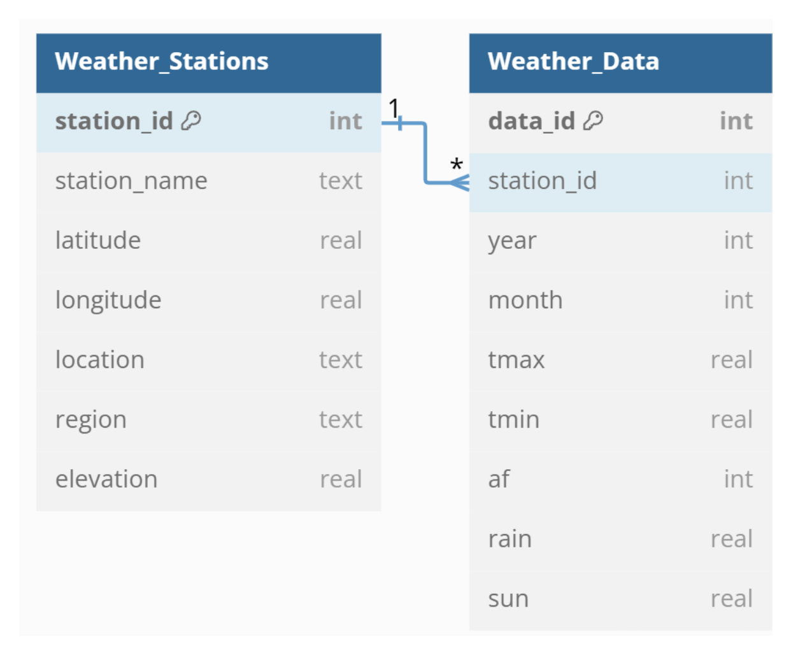

# uk_climate_database
A compilation of climate data from the UK Met Office

The Met Office offers a rich archive of historical data from several weather stations across the UK, accessible through its Historic Station Data webpage. The data is available in TXT format, which might make it easy to export to a spreadsheet, however, I undertook the task of compiling that data into a single database. This approach simplifies data access through SQL queries, enabling more comprehensive and thorough analysis.

